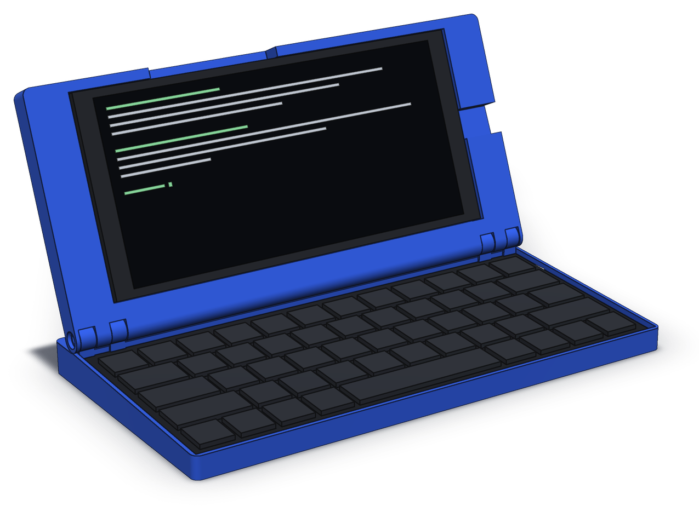
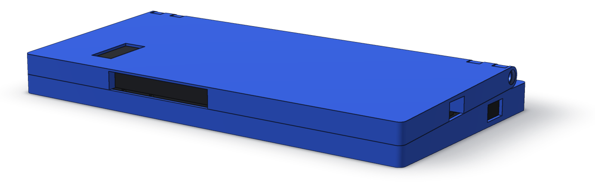

# Palmtop Mk3

A clamshell that turns a Pixel 3a XL into a pocketable laptop-shaped terminal.
Third iteration, after Mk1 (Blender) and Mk2 (FreeCAD), neither of them published.

Same phone, new keyboard — a Jomaa KEYBOARD098RU salvaged from its folio case.

<p align="center">
  
</p>

**The goal of Mk3 is to be as thin as possible.** Mk2 is roughly 32 mm closed;
Mk3's design point is 22.2 mm, with both components fully enclosed and the
keyboard never opened.

<p align="center">
  
  <br>
  <sub>Shut: 22.24 mm at the hinge, 18.26 at the front. Both renders come straight from the
  model via <code>cad/render.py</code>; the phone and keyboard are stand-ins built from
  their measured envelopes.</sub>
</p>

## Status

Measured, analysed, modelled, and now printing. The geometry is code — `cad/`
builds and self-verifies against the analyses — and the first printed coupons
caught two defects that no check could see, both of which are now checked for:
see [ADR-0010](docs/adr/0010-hinge-station-count.md).

**Design point: 22.24 mm closed at the rear, 18.26 at the front** — the keyboard
is a 2.64 deg wedge, so the closed device is one too.

| Doc | What it is |
|---|---|
| [requirements.md](docs/requirements.md) | Goals, constraints, acceptance criteria |
| [measurements.md](docs/measurements.md) | Every number, with a confidence tag |
| [analysis/thickness-budget.md](docs/analysis/thickness-budget.md) | Where the closed height goes, and three scenarios |
| [analysis/balance.md](docs/analysis/balance.md) | Whether the heavy lid tips it over, and what it costs to fix |
| [analysis/clamshell-geometry.md](docs/analysis/clamshell-geometry.md) | Why the lid is shallower than the base and the tail stays exposed |
| [plan.md](docs/plan.md) | Phases, critical path, and the five named risks |
| [parameters.md](docs/parameters.md) | Every driving dimension, paired with `cad/params.py` |
| [adr/](docs/adr/README.md) | Ten design decisions: six accepted, one rejected, three open |

## Findings so far

**Neither component gets thinner, so the skins had to go.** The keyboard shell is
9.52 mm and the phone 8.2 mm; together that is 90% of the budget and neither is
negotiable — [ADR-0002](docs/adr/0002-keyboard-integration-depth.md) keeps the
keyboard sealed and defers stripping it to Mk4. What remained were two 1.2 mm
skins: the lid's back and the base's floor. Deleting both is what gets the device
under 20 mm.

**Both skins were spent on enclosure, deliberately.** Neither was structurally
necessary: the keyboard's own bottom shell could have been the base's floor
(-1.2 mm), and the phone's own back could have been the lid's outer face
(-1.2 mm), for a 19.8 mm device with both components exposed.
[ADR-0008](docs/adr/0008-base-floor.md) and
[ADR-0004](docs/adr/0004-phone-retention.md) declined both. The result is 22.24 mm
with everything enclosed — a 30% reduction over Mk2 instead of 38%. That was the
trade, and it leaves only 0.26 mm against the current hard limit, which
[needs restating](docs/requirements.md#n1-needs-restating).

**The hinge is printed, not bought.** Holding the lid takes 0.10-0.12 N*m — the
very bottom of the commercial torque-hinge range, where Reell's scaled-down
consumer-electronics series starts at 0.11 N*m. Printed knuckles on two M3 bolted
stations deliver it at 22-25 N of clamp each, still a light load for an M3. The governing idea is that **the bolt sets deflection and a
compliant washer sets force**, so the setting is adjustable with a screwdriver
and survives PETG creep. Stations rather than a full-width rod, because racking
resistance comes from the span between the outermost points, not from continuity
— and a 193 mm printed barrel would bow. Two stations rather than three because
a bolt can only reach a station from outside the device: the lid's rounded rear
runs the full width along the hinge axis, so a centre station had no way in
([ADR-0010](docs/adr/0010-hinge-station-count.md)). No lead time, which took the longest
item off the critical path. Purchased torque hinges stay recorded as an upgrade
path in [ADR-0005](docs/adr/0005-hinge-mechanism.md).

**The tipping problem turned out to be free to fix.** The phone (167 g) outweighs
the keyboard (95 g) and the device tips past 127 deg of opening unaided. Fixing
it entirely — no tipping at any angle — costs 15 mm of rear setback, which is
zero mass and zero thickness — and the same 15 mm is where the hinge stations
stand. Nothing like the
substantial ballast that Mk2's `palmtop_weighted` name implies.

## Layout

```
docs/          requirements, measurements, analyses, ADRs
docs/img/      README renders, from cad/render.py
cad/           build123d model: params.py drives it, build.py checks and exports
export/        STL and STEP for printing, SVG drawings
```

## Licence

Copyright Dmitrii Trifonov 2026.

The design — the model in `cad/`, the files it exports, and the documentation — is
released under the [CERN Open Hardware Licence Version 2 – Strongly Reciprocal](LICENSE)
(CERN-OHL-S-2.0). Under this licence the Python model is the design's source: if
you adapt it, to a different phone or keyboard say, and distribute the result or
anything built from it, you share your modified source under the same terms.

Source location: <https://github.com/DmitriiTrifonov/palmtop-mk3>
